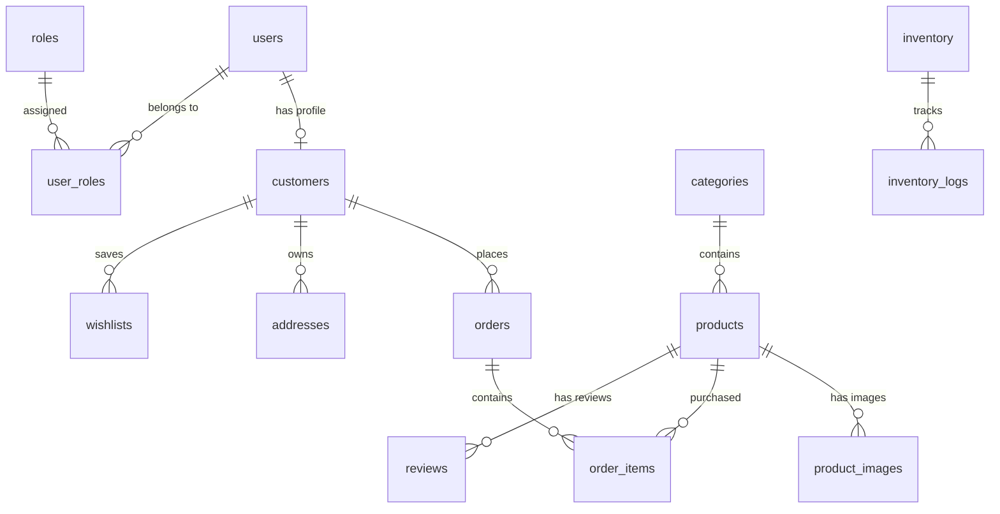

# Database ER Diagram & Entity Specification

This document details the database schema and table relationships for **Adil's Signature Kitchen**.

---

## 📊 Mermaid ER Diagram

---

## 🗄 Entity Definitions (22 Tables)

1. **`roles`**: System roles (`super_admin`, `admin`, `customer`).
2. **`permissions`**: Granular access control permissions.
3. **`role_permissions`**: Role-to-permission mappings.
4. **`users`**: Login credentials & verification.
5. **`user_roles`**: User-to-role mappings.
6. **`customers`**: Customer profiles & purchase metrics.
7. **`addresses`**: Customer shipping/billing addresses.
8. **`categories`**: Product categories (`Cake`, `Cup Cake`, `Tub Cake`, `Dream Cake`, `Burger`, `Roll`, `Samusa`).
9. **`products`**: Product details, prices, weights, stock.
10. **`product_images`**: Additional product gallery images.
11. **`carts`**: Active customer shopping carts.
12. **`cart_items`**: Cart product items & quantities.
13. **`wishlists`**: Saved customer favorite items.
14. **`orders`**: Customer placed orders (`ASK-2026xxxx-xxxx`).
15. **`order_items`**: Purchased order line items.
16. **`custom_cakes`**: Custom cake designer requests.
17. **`inventory`**: Raw bakery ingredients stock.
18. **`inventory_logs`**: Ingredient stock in/out movement logs.
19. **`reviews`**: Product reviews & star ratings.
20. **`coupons`**: Discount promo code rules.
21. **`blogs`**: Bakery blog posts and baking guides.
22. **`gallery`**: Photo gallery items.
23. **`testimonials`**: Featured customer feedback.
24. **`contact_messages`**: Contact form submissions.
25. **`settings`**: System key-value configurations.
