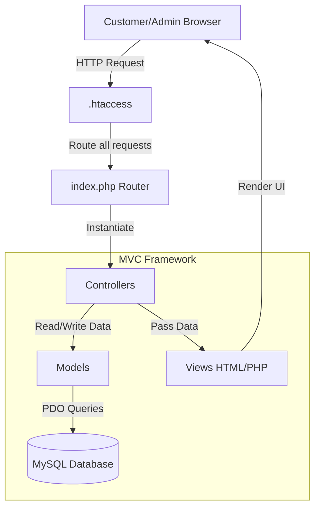
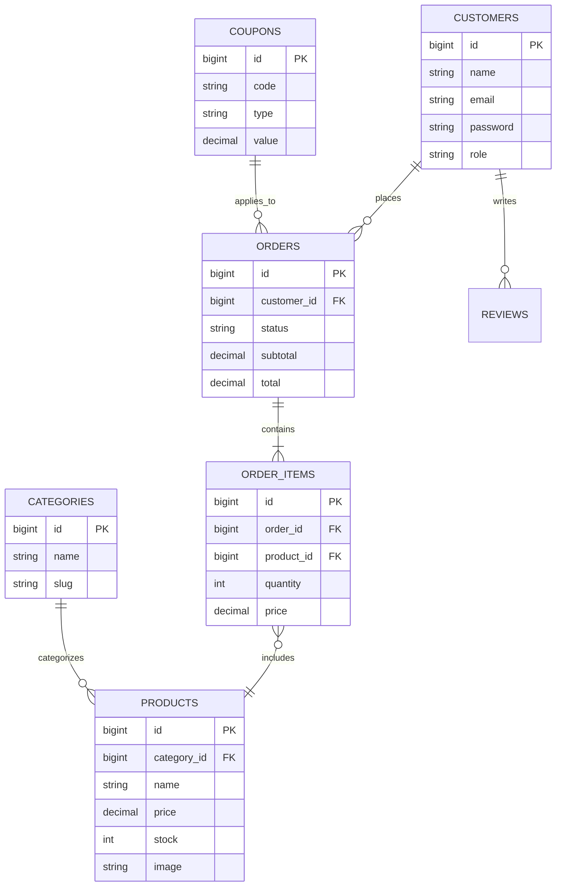

# Adil's Signature Kitchen 🍰

**Live Demo:** [adilkitchen.adirari.shop](https://adilkitchen.adirari.shop)

---

## 📑 Table of Contents
1. [Introduction](#1-introduction)
2. [Software Requirements Specification (SRS)](#2-software-requirements-specification-srs)
3. [System Architecture](#3-system-architecture)
4. [Database Architecture (ERD)](#4-database-architecture-erd)
5. [Directory Structure](#5-directory-structure)
6. [Local Setup Guide](#6-local-setup-guide)
7. [Deployment Guide (Hostinger)](#7-deployment-guide-hostinger)

---

## 1. Introduction
**Adil's Signature Kitchen** is a custom-built, high-performance E-Commerce platform tailored specifically for a homemade bakery and restaurant business in Dhaka, Bangladesh. The system provides a seamless and visually appealing storefront for customers to browse categories like Dream Cakes, Burgers, and Cupcakes, along with a powerful Admin panel to manage inventory, orders, and content.

It is built completely from scratch using native PHP in a Model-View-Controller (MVC) architecture, bypassing heavy frameworks to guarantee maximum speed and compatibility on standard shared hosting environments.

---

## 2. Software Requirements Specification (SRS)

### 2.1 Purpose
The purpose of this document is to outline the functional and non-functional requirements of the Adil's Signature Kitchen web platform.

### 2.2 User Roles & Capabilities
* **Guest:** Can browse products, view blogs, access the gallery, submit custom cake requests, and add items to the cart.
* **Customer:** Can register/login, place orders, view order history, leave product reviews, and manage their profile.
* **Admin / Super Admin:** Can access the secure backend dashboard to manage products, categories, orders, customers, blogs, gallery images, coupons, and view sales reports.

### 2.3 Functional Requirements
* **Product Management:** Complete CRUD (Create, Read, Update, Delete) operations for products and categories. Support for stock management, featured items, and best sellers.
* **Cart & Checkout:** Dynamic AJAX-based cart system utilizing PHP sessions. Supports percentage and fixed-amount discount coupons.
* **Order Management:** Tracking of order lifecycle (Pending → Processing → Shipped → Delivered/Cancelled). Admin invoice generation.
* **Content Management:** Integrated blogging system and photo gallery.
* **Security:** CSRF token protection on all forms, XSS output sanitization, SQL Injection prevention via PDO prepared statements, and secure password hashing.

### 2.4 Non-Functional Requirements
* **Performance:** Lightweight footprint ensuring load times under 2 seconds.
* **Compatibility:** Fully responsive across all devices (Mobile, Tablet, Desktop) using Bootstrap 5.
* **Hosting:** Designed with a "flat" directory structure specifically for shared hosting environments (like Hostinger's `public_html`).

---

## 3. System Architecture

The application strictly follows the **Model-View-Controller (MVC)** architectural pattern. 



* **Router (`index.php`):** The single entry point. It parses the URL, handles namespaces, and dispatches the request to the appropriate controller.
* **Controllers (`app/controllers/`):** Contains the business logic. Handles inputs, interacts with models, and loads the corresponding views. Separated into Customer and Admin namespaces.
* **Models (`app/models/`):** Represents data structures. Extends a base `Model` class that provides an Active Record-style wrapper around the Database class.
* **Views (`app/views/`):** The presentation layer. Uses native PHP templating for dynamic data injection into HTML.

---

## 4. Database Architecture (ERD)

The database is highly relational, utilizing Foreign Keys for data integrity.



*(Note: The actual schema contains additional tables for Carts, Settings, Contact Messages, Gallery, Blogs, and Custom Cakes.)*

---

## 5. Directory Structure

```text
adil-s-kitchen/
├── app/
│   ├── controllers/    # Business logic (Admin/ & Customer)
│   ├── core/           # Base MVC classes (Router, Database, Controller, Model)
│   ├── models/         # Database wrappers
│   ├── services/       # Complex business logic separation
│   └── views/          # HTML templates
├── assets/             # CSS, JavaScript, and static system images
├── config/             # Environment & App configuration files
├── database/           # SQL dumps and seeders
├── public/             # (Deprecated) Old public folder context
├── tests/              # PHPUnit testing suites
├── uploads/            # User-uploaded content (products, blogs, gallery)
├── .htaccess           # Apache rewrite rules for security and routing
└── index.php           # Application Front Controller & Autoloader
```

---

## 6. Local Setup Guide

Follow these steps to run the project locally on your machine for development.

1. **Clone the repository:**
   ```bash
   git clone https://github.com/ahsam991/adil-s-kitchen.git
   cd adil-s-kitchen
   ```

2. **Database Configuration:**
   * Open your local MySQL server (e.g., XAMPP, MAMP).
   * Create a new database (e.g., `adil_kitchen_db`).
   * Copy `config/env.php.example` to `config/env.php` and update it with your local database credentials.
   * Import the full database schema and seed data by running the script located at `database/install_database.sql` inside phpMyAdmin.

3. **Install Dependencies (Optional for Testing):**
   ```bash
   composer install
   ```

4. **Run the local server:**
   Use PHP's built-in server to run the application from the root directory:
   ```bash
   php -S localhost:8000
   ```
   *Visit `http://localhost:8000` in your browser.*

---

## 7. Deployment Guide (Hostinger)

This project has been heavily optimized for "flat" deployment on standard shared hosting environments like Hostinger's hPanel or cPanel.

1. **Upload Files:**
   * Compress the entire project into a `.zip` file (excluding `.git` and `tests`).
   * Upload and extract the `.zip` directly into your `public_html/` folder on Hostinger. *Do not put it in a subfolder unless that is your intended domain root.*

2. **Database Setup:**
   * In Hostinger, navigate to **MySQL Databases** and create a new database and user.
   * Open **phpMyAdmin**, select your new database, and import `database/install_database.sql`.
   * Open `config/env.php` via the Hostinger File Manager and update the database name, username, and password to match the ones you just created.

3. **File Permissions:**
   * Ensure that the `uploads/` directory has write permissions (`0755` or `0777`) so that the Admin panel can successfully upload images for products and blogs.

4. **SSL Configuration:**
   * Ensure your Hostinger SSL is active. The application will automatically route properly based on the incoming domain request.

---
*Built with ❤️ for Adil's Signature Kitchen.*
